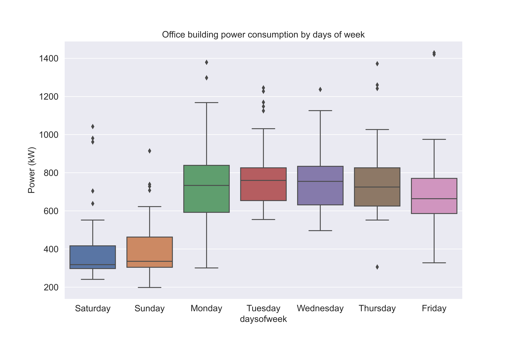

# Visualizations-Power-Usage

Visualize a commerical building power consumptions of each day. The dataset contain two main categorial of buildings including Retail store, and Office.

From the box-whisker graphs between retail and office building. It has been identified that the retail building used the same amount of energy during weekday and weekend.
In other hand, the office building used less amount of energy during weekend.

## Retail building days of week power consumption.

## Office building days of week power consumption.

*Tableau url: https://public.tableau.com/app/profile/lim.chhayly/viz/CommericalBuildingsPowerConsumptions/PowerConsumption?publish=yes

*Note: currently, the dataset are not available for download on the official website anymore!
Dataset url: https://data.openei.org/submissions/603
